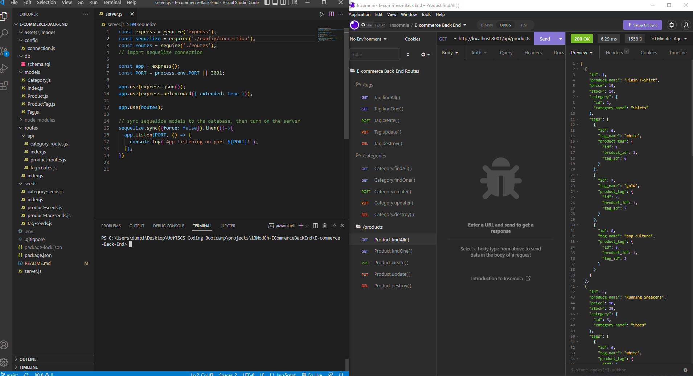

# E-commerce-Back-End
UofT SCS BootCamp: Module 13: Object-Relational Mapping(ORM)

## Purpose
* User Story:
    * AS A manager at an internet retail company:
        * I WANT a back end for my e-commerce website that uses the latest technologies
        * SO THAT my company can compete with other e-commerce companies

## Built-With
* This application was built with:
    * Javascript
    * Node.js
    * npm dotenv
    * npm mysql2
    * npm sequelize

## Repository
* [Repository Link] (https://github.com/Bryandumpit/E-commerce-Back-End)

## Preview and Walkthrough

[Walkthrough Video](https://drive.google.com/file/d/1qnV3pqJ7c4C5C1wMmlc9aOLYYq7PaSaD/view)"eCommerce Back End Setup Video"  
[Walkthrough Video](https://drive.google.com/file/d/1PGR6Qg-haMZyY46YtrkHOGEXSKZ6Z8Tm/view) "eCommerce Back End API Routes Video"

## Contribution
Made with ❤️ by Bryan Dumpit!

